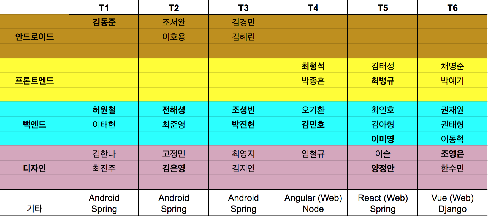

# 2018/04/07 미니프로젝트

디프만 4기의 4번째 세션은 바로 미니프로젝트 입니다!  
이 저장소는 미니프로젝트 진행 가이드라인을 담았으며, 추후에 여러분들의 작업물을 팀별로 디렉토리에 저장해 둘 예정입니다.

여기 적힌 가이드라인이나 체크리스트는 **최소한의 가이드** 이며, **꼭 이 가이드를 따르실 필요 없이** 재밌게 작업만 같이 하시면 됩니다!

## 팀 빌딩

## 주제 및 제약사항

주제는 **OOO 게시판 만들기** 이며, OOO 안에 들어가는 토픽은 팀당 자유입니다. 하지만,

1. 로그인 및 회원가입 기능을 만들어 주세요.
2. 컨텐츠의 CRUD(생성, 조회, 수정, 삭제) 기능을 포함해 주세요.
3. 하나 이상의 오픈 API(예시: 날씨 API) 를 사용해 주세요!

## 규칙

- **완성이 목표가 아니고 같이 작업해보는게 목표** 입니다! 완성도나 퀄리티에 대한 압박을 가지시는 것은 오히려 팀에게만 손해가 될 수 있으니 최대한 재밌게! 작업해봅시다.
- 당연히 **한 사람이 전부 코딩 혹은 디자인 하는 것은 금지**입니다. 추후에 작업물을 확인해서 독단 작업이 확인된 팀은 **수상에서 제외** 하도록 하겠습니다.
- **최대한 토요일 안**에 하실 수 있는 데 까지만 마무리하시고, 그럼에도 완성을 원하시는 팀은 **11일(수) 까지** 시간을 드리도록 하겠습니다. 해당 시간 이후에 작업 내역이 있는 팀도 역시 **수상에서 제외**됩니다.

## 팀별로 해야할 일들

1. 팀별로 **PM(프로젝트 매니저)** 를 뽑으세요. PM 으로는 가장 경험이 많은 사람이나, 가장 성격이 주도적인 사람이나, 혹은 가장 말이 많은 사람이 좋습니다.
뽑히신 PM 분들은 [PM 체크리스트](https://github.com/depromeet/180407-1stMINI/blob/master/PM-checklist.md) 에 따라서 팀이랑 같이 재밌게 작업하도록 이끌어 주시면 됩니다!
2. 개발자들은 [개발 체크리스트](https://github.com/depromeet/180407-1stMINI/blob/master/dev-checklist.md) 를 완료해 주세요
3. 디자이너들은 [디자인 체크리스트](https://github.com/depromeet/180407-1stMINI/blob/master/design-checklist.md) 를 완료해 주세요
4. 작업물(소스코드 및 적절한 이미지들) 들은 팀에서 따로 저장소를 파서 올려주시면 되며, 11일(수) 까지 저한테 링크를 보내 주시면 됩니다.
5. 다음주 4월 14일(토) 에는 미니프로젝트 발표가 있습니다. 발표때 사용하실 **슬라이드** 도 11일(수) 까지 보내주셔야 합니다.